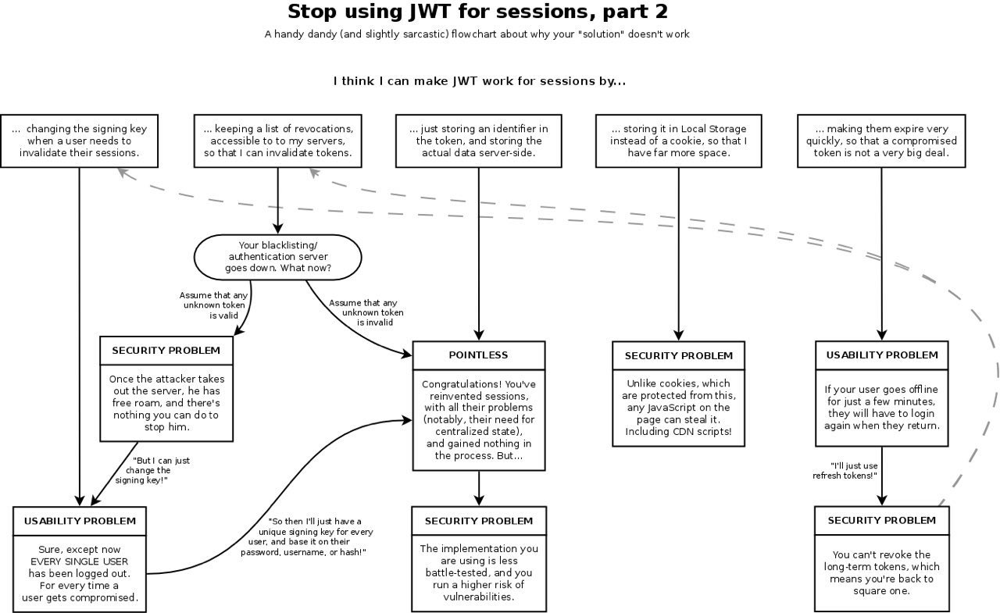
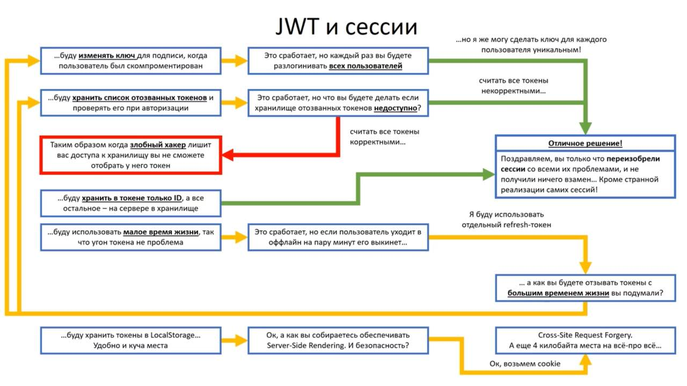

# Why JWT is bad for Authentication

Сохраненная копия ныне мертвого телеграм-канала «Why JWT is bad for Authentication»

## 30.07.2018

Весёлые дыры:
- [2015](https://auth0.com/blog/critical-vulnerabilities-in-json-web-token-libraries/):
  кто-то прочитал спеку и внезапно заметил что токены, в которых стоит
  "alg": "none" валидны всегда, а ограничений в либах никто не предусмотрел, и народ просто проверял JWT на валидность.
- [2017](https://blogs.adobe.com/security/2017/03/critical-vulnerability-uncovered-in-json-encryption.html) (начало года): Атака на извлечение приватного ключа с сервера, по протоколу.
- [2017](https://cve.mitre.org/cgi-bin/cvename.cgi?name=CVE-2018-0114) (конец года): кто-то прочитал спеку ещё раз и заметил, что «самоподписанные» токены, которые включают в себя свой ключ, валидны всегда. А народ всё ещё тупо проверяет JWT на валидность. Это затронуло, например, node-jose. Исправили со сломом совместимости.

> Народ, кто юзает JWT — вы вообще в курсе, что он по спеке при проверке токена (то есть до подверждения его валидности) ходит по урлам c вашего сервера, указанным в этом токене? От этого пока всё вокруг не сгорело скорее всего потому, что в либах JWТ эту часть пока не реализовали (JWT ­— заоверенжинерен, с реализациями плохо всё).

Основная часть JWT — это вот эта пачка спек:
- https://tools.ietf.org/html/rfc7519
- https://tools.ietf.org/html/rfc7515
- https://tools.ietf.org/html/rfc7516

https://tools.ietf.org/html/rfc7515#section-4.1.5 — вот тут про хождение по урлам в процессе валидации, например.

## 25.08.2018

https://medium.com/@cjainn/anatomy-of-a-jwt-token-part-2-c12888abc1a2

> As you see from above, JWT if implemented incorrectly can have huge security implications for the security of your system and your authentication and authorization schemes can be easily hacked or manipulated to a hacker’s advantage.

## 11.09.2018

## 10.10.2018

## 15.05.2021

https://evertpot.com/jwt-is-a-bad-default/

## 04.08.2021

Наконец-то хорошее объяснение почему JWT в большинстве случаев это бред. Ну а точнее JWT в LocalStorage

https://itnext.io/heres-why-storing-jwt-in-local-storage-is-a-great-mistake-df01dad90f9e
